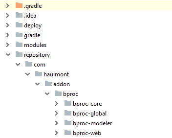
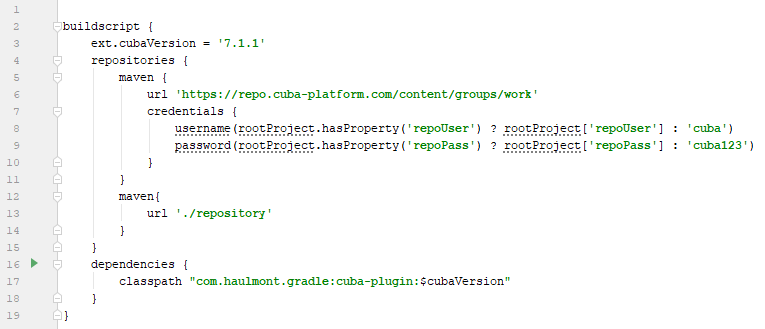
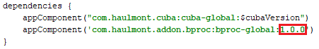
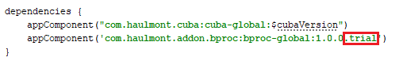

# CUBA Petclinic: Bproc

<p align="center">
  
</p>

This is a variation of [CUBA Petclinic](https://github.com/cuba-platform/cuba-petclinic) application working with the [CUBA Bproc add-on](https://www.cuba-platform.com/marketplace/bproc/).

[Video tutorial](https://youtu.be/znq5P0Tk55k) demonstrates creating and testing this demo project.

## Domain model


## Testing demo project

To run and test the project follow the steps:
1. Clone the repository of the demo project and open it in [CUBA Studio](https://www.cuba-platform.com/tools/).
2. In case you don't have a subscription, get and install the trial version of the **Bproc** add-on according to the [How to Install the Bproc Add-on Trial Version](#trial) section.
3. Create database and run the application.
4. Login as admin. Three extra users are added while database creation.
 * with the *Chief* role:
    * login: `oak`, password: `oak`
 * with the *Vet* role:
    * login: `birch`, password: `birch`
    * login: `rowan`, password: `rowan`
5. Expand the *Bproc* section in the main menu and choose *Modeler*. Click the *Download* button in the upper-right corner.
6. Find the `bpmn` folder in the root directory of the demo project and select the `new-visit.bpmn20` file.
7. Click the *Deploy* button. The business process model will be deployed.

## How to Install the Bproc Add-on Trial Version <a name="trial"></a>

 You can get trial subscription from [CUBA Marketplace](https://www.cuba-platform.com/marketplace/bproc/) to run this application on your local environment. After getting trial subscription you'll receive an email with a link for downloading ZIP archive with artifacts.

 To install the trial version of BProc add-on:

 1. Get trial subscription from [CUBA Marketplace](https://www.cuba-platform.com/marketplace/bproc/). You'll get an email with a link and instructions.

 2. Download ZIP archive with artifacts at link from the email.

 3. Clone the repository of this demo project.

 4. Open demo project in CUBA Studio.

 5. Create a directory called `repository` in the root directory of the demo project.

 6. Unzip the file with artifacts into this directory. You should get the following directory structure:

  

 7. Open `build.gradle` file and register a new Maven repository.
  ```
  maven {
      url './repository'
  }
  ```
   

 8. Find a string with add-on coordinates and replace the add-on version with the latest one. Check the latest version on [CUBA Marketplace](https://www.cuba-platform.com/marketplace/bproc/).

  

 9. Then add `.trial` to the end of add-on coordinates.

  

 10. Go to *CUBA -> Build Tasks -> Deploy* to check that the add-on was installed successfully.     
